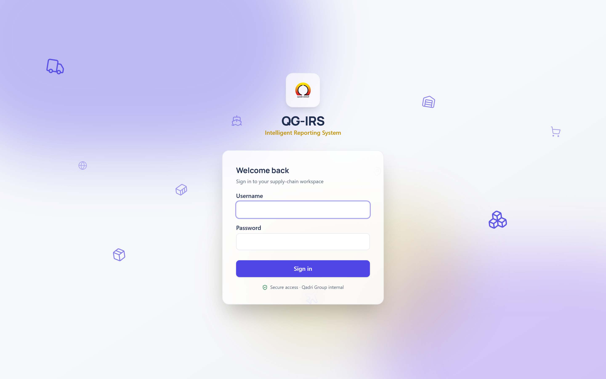
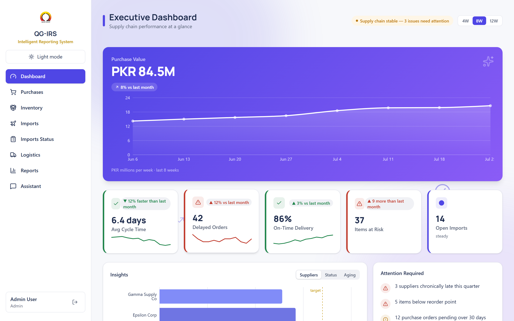
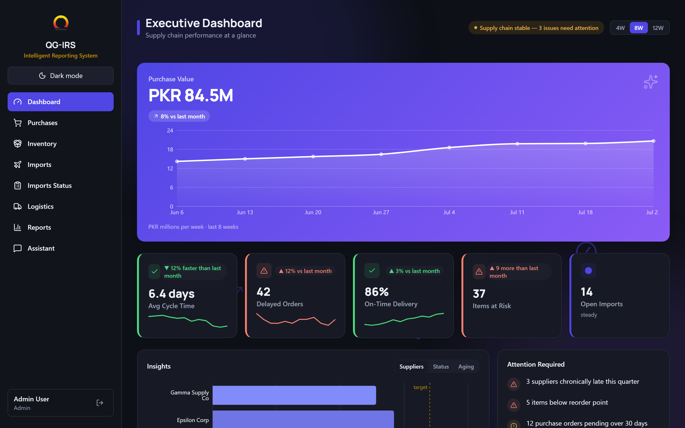
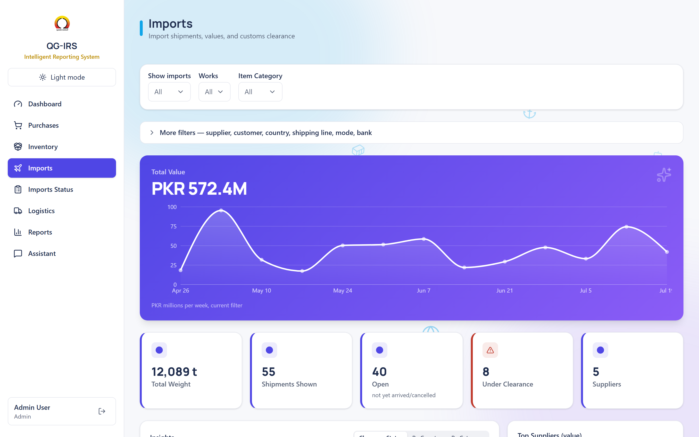
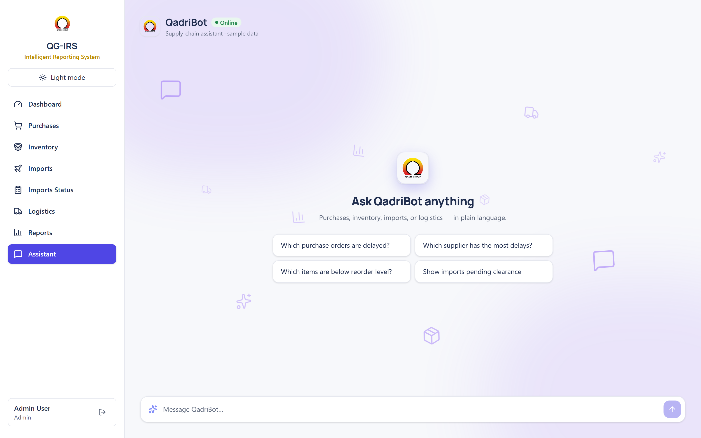

# QG-IRS — Qadri Group Intelligent Reporting System

An internal **AI Supply Chain Intelligence Platform** for **Qadri Group**, a
manufacturing company. QG-IRS turns supply-chain data — purchases, inventory,
imports, logistics — into a fast, executive-friendly reporting workspace:
dashboards, custom reports, and a natural-language assistant, all in one place.

It runs on the company's own network (no cloud), and is used by everyone from
directors to data-entry clerks — so it's built to be simple to read yet
powerful underneath, and it's presented to top management.

> **Status:** active development. The full UI is built and running on realistic
> sample data. The production database/API is a separate teammate's workstream
> and is swapped in later without changing the pages (see
> [Data & the backend](#data--the-backend)).

<p align="center">
  
</p>

---

## Screens

| Executive Dashboard | Dark mode |
| --- | --- |
|  |  |

| Imports | QadriBot assistant |
| --- | --- |
|  |  |

---

## What's inside

Ten sections, reachable from the sidebar:

| Section | What it shows |
| --- | --- |
| **Dashboard** | Executive overview — headline KPIs, purchase-value trend, supplier performance, status split, aging, and an attention feed. |
| **Purchases** | Purchase orders by supplier / branch / category with KPIs, charts, and a searchable table. |
| **Inventory** | Current stock levels, out-of-stock / below-reorder risk, and stock-runway insights. |
| **Imports** | Import shipments, values, and customs-clearance status. |
| **Imports Status** | Consignment tracking with a multi-step data-entry wizard (teammate-owned). |
| **Logistics Status** | Export / local order tracking with a five-step data-entry wizard — **scaffold only** for now: the list and detail screens are placeholders, no real records yet. |
| **Trucking Status** | Vehicle-movement jobs (Intrafactory / Outbound / Inbound) with a four-step data-entry wizard covering movement details, per-vehicle tracking, freight & payment, and a delivered-fraction rollup. Its list also surfaces live, never-copied "open request" rows read straight from Logistics Status and Imports Status once they're past production — see [Data & the backend](#data--the-backend). |
| **Logistics** | Export shipments, packing, transport, and documentation. |
| **Reports** | A custom report builder — pick a source, columns, and filters, then export. |
| **Assistant (QadriBot)** | Ask about the data in plain language and get an answer, table, or chart back. |

Across every page:

- **Light & dark mode** — toggle in the sidebar, remembered between visits.
- **Role-based access** — four roles gate *actions* (see [Roles](#roles--permissions)).
- **Themed, animated backgrounds** — each section has a subtle backdrop of
  drifting, subject-related icons (planes & ships on Imports, boxes & forklifts
  on Inventory, …) over soft accent-tinted glows.
- **Motion throughout** — hover lift on cards, fade-in page and tab
  transitions, animated filter dropdowns.

---

## Tech stack

- **[Vite](https://vite.dev/) + [React 19](https://react.dev/) + TypeScript**
- **[Tailwind CSS v4](https://tailwindcss.com/)** with shadcn-style UI primitives
- **[Recharts](https://recharts.org/)** for charts
- **[React Router](https://reactrouter.com/)** for navigation
- **[lucide-react](https://lucide.dev/)** for icons
- **[react-hook-form](https://react-hook-form.com/) + [zod](https://zod.dev/)**
  for multi-step forms
- **[TanStack Query](https://tanstack.com/query)** (ready for when the real API lands)

---

## Run it

The app is currently **frontend-only** — all data is mocked in the browser, so
there's nothing else to start.

```bash
cd frontend
npm install      # first time only
npm run dev
```

Open the URL Vite prints (**http://localhost:5173**) and sign in with one of the
demo accounts below.

Other scripts:

```bash
npm run build    # production bundle
npm run preview  # serve the production build locally
npm run lint     # oxlint
```

### Demo credentials

| Username | Password | Role |
| --- | --- | --- |
| `admin` | `admin123` | admin |
| `manager` | `admin123` | manager |
| `entry` | `admin123` | entry |
| `viewer` | `admin123` | viewer |

> These are a **frontend-only development gate**, not real security — anyone can
> read them from the shipped JS. They exist only so the UI can be built and
> reviewed before the real login API exists. See
> [Data & the backend](#data--the-backend).

---

## Project structure

```
frontend/
├── src/
│   ├── pages/                 one file per report/dashboard tab
│   │   └── logistics/         Logistics' four sub-views
│   ├── features/
│   │   ├── auth/              login, auth context, protected routes
│   │   ├── importsStatus/     consignment tracking + entry wizard
│   │   ├── logisticsStatus/   order tracking + entry wizard (scaffold only)
│   │   └── truckingStatus/    vehicle-movement tracking + entry wizard
│   ├── components/            shared UI (cards, filters, charts, layout, …)
│   │   └── charts/            themed Recharts wrappers
│   ├── lib/
│   │   ├── mockData/          sample data — the swap-for-real-API boundary
│   │   ├── mockAuth.ts        temporary login stub
│   │   ├── pages.ts           sidebar / route registry (single source of truth)
│   │   └── roleAccess.ts      roles + the can() permission helper
│   ├── theme/                 design tokens + light/dark palettes
│   └── index.css              CSS variables, Tailwind theme, keyframes
docs/screenshots/              images used in this README
```

To **add or reorder a tab**, edit `src/lib/pages.ts` (sidebar) and
`src/App.tsx` (routes) — nothing else needs to know.

---

## Roles & permissions

Four roles, defined in `src/lib/roleAccess.ts`:

| Role | Enter | Edit existing | Reports | Manage users | Manage masters |
| --- | --- | --- | --- | --- | --- |
| admin | yes | yes | yes | yes | yes |
| manager | yes | yes | yes | no | yes |
| entry | yes | own drafts only | yes | no | inline-create only |
| viewer | no | no | read-only | no | no |

Every role can **see every page** and all financial values — the matrix only
restricts *actions* (create / edit / manage). Components ask one question rather
than checking role strings inline:

```ts
import { can } from '@/lib/roleAccess'

if (can(user, 'enter')) {
  // show the "New" button
}
```

---

## Design system

- **Colors, fonts, and status meanings live in one place** —
  `src/theme/tokens.ts` (JS values, for charts) and `src/index.css` (CSS
  variables, flipped by the `.dark` class). A rebrand is a one-file change;
  **keep the two in sync** if you touch the palette.
- **Navy** is structure, **gold** is the brand accent, an **indigo→violet**
  gradient is the one signature highlight, and **red / amber / green** are used
  *only* for status (risk / watch / healthy), never decoration.
- **All charts go through `src/components/charts/`** so they stay consistent and
  theme-aware in both light and dark mode.

---

## Data & the backend

The frontend never talks to a database or does calculations itself. Today every
page reads from **mock modules in `src/lib/mockData/`** that return realistic
sample data. When the production API (a separate teammate's workstream) is
ready, those modules — and `src/lib/mockAuth.ts` — are swapped for real API
calls. **The pages don't change**: same data shapes in, same UI out.

This keeps the two workstreams cleanly separated and lets the UI be built,
reviewed, and demoed now without waiting on the backend.

---

## Working in this repo

Two of us build the React app side by side:

- **Report & dashboard pages** (the eight sections above) — `src/pages/`,
  `src/features/auth/`, shared `src/components/`.
- **Data-entry pages** (e.g. the Imports Status wizard) —
  `src/features/importsStatus/`.

To keep merges painless, the shared "registry" files are **additive by design**:
adding a page is a one-line addition to `src/lib/pages.ts` and a route in
`src/App.tsx`, not a rewrite of shared logic. Pull before touching those files.

**Forms:** anything beyond a couple of fields uses **react-hook-form + zod** —
follow the pattern in `src/features/importsStatus/` (one zod schema per step,
one `useForm`, validate the current step on “Next”) rather than hand-rolling
`useState`.

**Nested routes:** a feature with more than one screen nests its routes under a
single parent path (see `/imports-status` in `src/App.tsx`) rather than adding
loose top-level routes.
